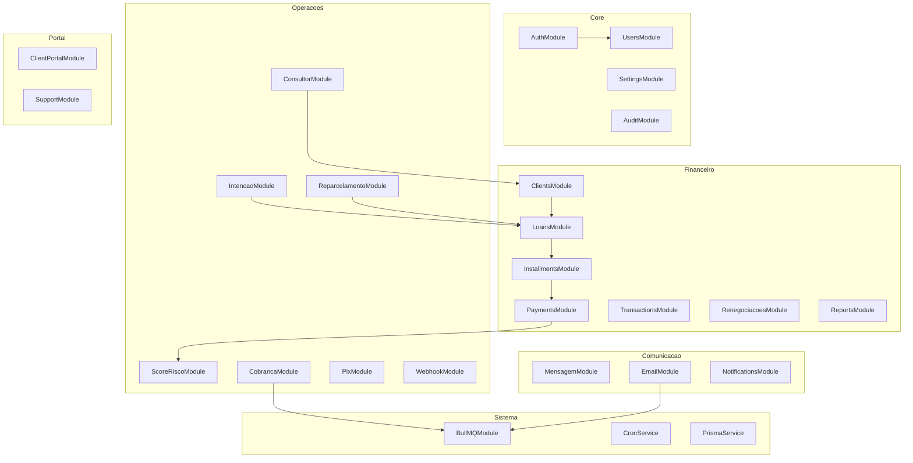
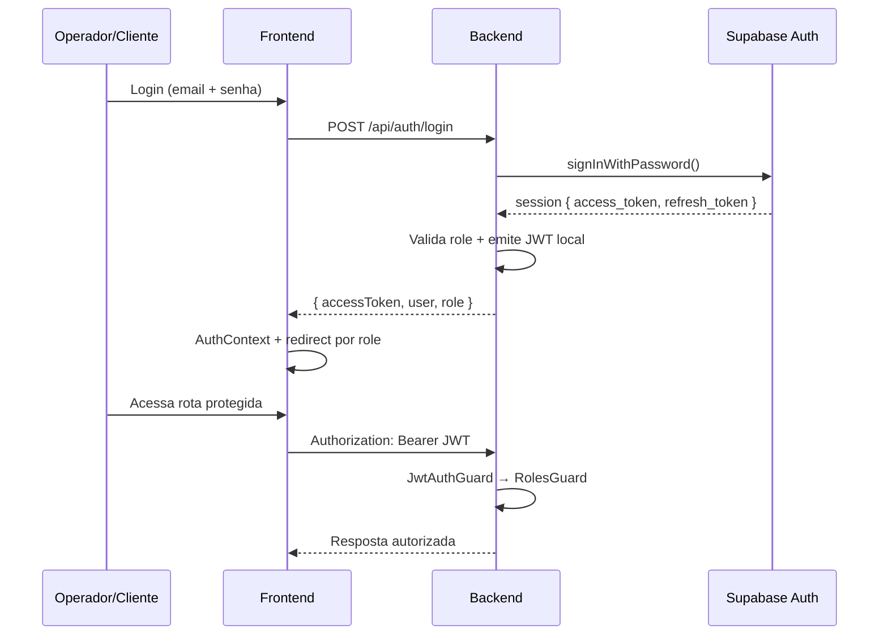
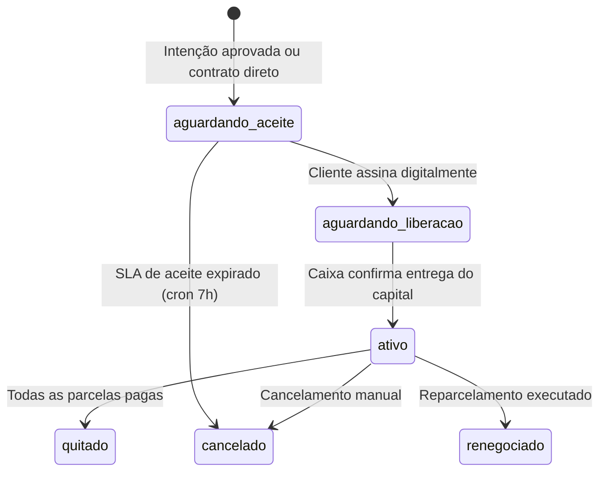

# SIAFI 2.0 — Arquitetura do Sistema
> Última atualização: 2026-05-23 | Versão: 2.0

---

## 1. Visão Geral

O SIAFI 2.0 é um **monolito modular** composto por backend NestJS e frontend Next.js, conectados ao Supabase (PostgreSQL + Auth + Storage + Realtime) e à infraestrutura de filas BullMQ + Redis (Upstash).

| Componente | Tecnologia | Porta |
|-----------|------------|-------|
| Backend API | NestJS 10 + TypeScript 5 + Prisma 5 | 4010 |
| Frontend Web | Next.js 16 + TypeScript 5 + Tailwind CSS 4 | 4011 |
| Banco de Dados | PostgreSQL via Supabase (sa-east-1) | — |
| Autenticação | Supabase Auth (GoTrue) + JWT local | — |
| Filas | BullMQ + Redis (Upstash) | — |
| Realtime | Supabase Realtime (postgres_changes) | — |
| Storage | Supabase Storage | — |
| Deploy | NSSM (Windows Service) + Nginx + SSL Let's Encrypt | 443/80 |

---

## 2. Diagrama de Módulos

---

## 3. Fluxo de Autenticação

**MFA obrigatório imediato:** admin, financeiro, consultor
**MFA com prazo de 5 logins:** caixa, cliente

**OAuth Google:** Supabase OAuth → callback `/auth/callback` → emissão do JWT local com mesmo fluxo.

---

## 4. Ciclo de Vida do Contrato

**SLA de aceite:** configurável via `financeiro.sla_aceite_dias`. Ao expirar, o cron cancela o loan, cancela as parcelas e reverte a IntencaoEmprestimo para `aprovado`.

**Liberação de capital:** ao confirmar, o sistema reajusta as datas das parcelas a partir da data real de entrega, registra saída no caixa e notifica o cliente.

**Status das parcelas:**

| Status | Descrição |
|--------|-----------|
| `pendente` | Não venceu |
| `pago` | Pago integralmente |
| `parcialmente_pago` | Pagamento parcial — saldo devedor em aberto |
| `atrasado` | Vencida sem pagamento integral |
| `cancelado` | Loan cancelado |

---

## 5. Filas BullMQ

Duas filas gerenciadas pelo BullMQ com Redis (Upstash):

### notif-queue — Notificações

| Job Type | Trigger | Ação |
|----------|---------|------|
| `send-whatsapp` | Pagamento, vencimento, cobrança | Evolution API (WhatsApp) |
| `send-email` | Boas-vindas, aprovação, rejeição, cobrança, reparcelamento | SMTP via Nodemailer |
| `activate-portal` | Intenção aprovada (sem supabase_id) | Cria usuário Supabase + envia boas-vindas |

### payment-queue — Pagamentos

| Job Type | Trigger | Ação |
|----------|---------|------|
| `confirm-mp-payment` | Webhook Mercado Pago | Marca parcela como paga |
| `retry-webhook` | Falha na confirmação | Reprocessa até 3 tentativas |

---

## 6. Supabase Realtime

Publication `supabase_realtime` com as seguintes tabelas ativas:

| Tabela | Evento | Consumidor |
|--------|--------|-----------|
| `mensagens` | INSERT | `useConversaRealtime` — chat interno |
| `solicitacoes_reparcelamento` | UPDATE | Dashboard financeiro |
| `installments` | UPDATE | Portal do cliente |
| `payments` | INSERT | Dashboard caixa |
| `transactions` | INSERT | Saldo do caixa em tempo real |

---

## 7. Storage Buckets

| Bucket | Conteúdo | Acesso |
|--------|----------|--------|
| `client-documents` | Foto, RG, comprovante de residência | Privado — operadores via JWT |
| `boletos-cobranca` | PDFs de boletos gerados | Privado — URL assinada gerada pelo backend |
| `mensagens-docs` | Anexos do comunicador interno | Privado — participantes da conversa |

---

## 8. Cron Jobs

| Job | Horário | Efeito |
|-----|---------|--------|
| `markOverdue` | 08:00 | Marca parcelas vencidas como `atrasado`, recalcula score (fire-and-forget) |
| `sendReminders` | 09:00 | Lembrete de vencimento próximo (WhatsApp + Email) |
| `sendOverdue` | 10:00 | Cobrança de parcelas em atraso |
| `verificarSlaIntencoes` | A cada 2h | Expira intenções fora do SLA de 24h |
| `verificarSlaAceite` | 07:00 | Cancela contratos com SLA de aceite expirado |
| `enviarCobrancasAntecipadas` | 08:30 | Cobrança X dias antes do vencimento (configurável por contrato) |
| `atualizarEncargos` | 00:00 | Recalcula mora diária sobre saldos devedores |
| `lembreteReparcelamentos` | 11:00 | Alerta consultor sobre reparcelamentos pendentes de ação |
| `reenviarCobrancaNaoLida` | 14:00 | Reenvia cobrança sem confirmação de leitura |

---

## 9. Segurança em Camadas

| Camada | Mecanismo | Onde |
|--------|-----------|------|
| Autenticação | JWT (Supabase Auth + assinatura local) | Todos os endpoints exceto `/api/auth/login` e `/api/webhook/mp` |
| Autorização | `RolesGuard` + `@Roles()` | Por endpoint, baseado no campo `role` do JWT |
| Isolamento de dados | Filtro por `consultorId` no service | Módulos Consultor, Cobranças, Solicitações |
| Banco de dados | RLS Supabase (Row Level Security) | Tabelas `loans` e `installments` — cliente vê apenas os seus |
| Rastreabilidade | `AuditInterceptor` (imutável) | Todas as mutações (POST, PATCH, DELETE) |
| Campos protegidos | `principal_payback` / `net_gain` nunca serializados para caixa/cliente | Módulo Portal + serialização de Loan |

---

## 10. Ambientes

| Item | Desenvolvimento | Produção |
|------|----------------|---------|
| Portas | Backend :4010 · Frontend :4011 | Nginx → 443 (SSL) |
| Serviços | Manual (`npm run start:dev`) | NSSM Windows Service |
| Banco | Supabase Cloud (mesmo projeto) | Supabase Cloud |
| Redis | Upstash (mesmo) | Upstash |
| Variáveis | `.env` local | `.env` no servidor |
| SSL | Não | Let's Encrypt via Nginx |
| Logs | Console | NSSM stdout redirect |

---

*Última atualização: 2026-05-23 | Mantido por: equipe SIAFI*
