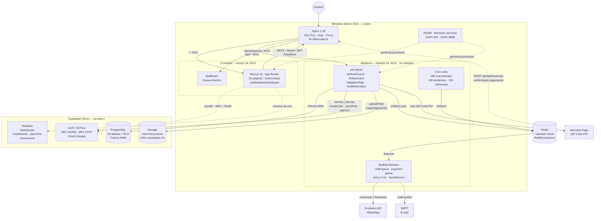

# SIAFI 2.0 — Arquitetura

## Decisão: Monolito Modular vs Microsserviços

**Escolha: Monolito Modular**

NestJS com módulos bem delimitados. Cada módulo tem seu próprio controller, service, repository e DTOs. Comunicação entre módulos via injeção de dependência, não via HTTP.

**Por quê não microsserviços:**
- O SIAFI é um sistema financeiro de porte médio
- Complexidade operacional de microsserviços não se justifica
- Time pequeno, manutenção simples
- Pode ser extraído para microsserviços no futuro se necessário

---

## Diagrama Geral



**Legenda:** seta sólida = chamada direta · seta tracejada = evento externo / callback / gerenciamento

---

## Fluxo de Requisição

```
Cliente (browser/mobile)
    │
    ▼
Nginx :443 (SSL termination, gzip, headers de segurança)
    │  /api/*          → localhost:4010 (NestJS)
    │  /admin/queues   → localhost:4010 (BullBoard)
    │  /*              → localhost:4011 (Next.js)
    │
    ▼
NestJS :4010
    │
    ├── Guards: JwtAuthGuard (valida JWT Supabase) → RolesGuard
    ├── Pipe: ValidationPipe (class-validator, whitelist, transform)
    ├── Interceptor: AuditInterceptor (log de ações)
    │
    ▼
Service → Prisma → PostgreSQL (Supabase Cloud sa-east-1)
       → BullMQ  → Redis (Upstash) → Workers → WhatsApp / E-mail
                  + Supabase Auth (GoTrue) — sessões e MFA
                  + Supabase Storage — documentos de clientes
                  + Supabase Realtime — atualizações ao vivo
```

---

## Auth Flow (Supabase GoTrue + JWT)

```
1. POST /api/auth/login
   → valida credenciais localmente (bcrypt)
   → auto-sync usuário para Supabase Auth (primeira vez)
   → signInWithPassword no Supabase Auth
   → retorna { accessToken (JWT Supabase), user }
   → seta refreshToken Supabase em httpOnly cookie (7d)

2. Frontend armazena:
   → accessToken: memória (AuthContext)
   → refreshToken: httpOnly cookie (automático)

3. A cada request:
   → Authorization: Bearer <accessToken>
   → JwtAuthGuard valida assinatura JWT com SUPABASE_JWT_SECRET
   → Extrai { sub (supabaseId), app_metadata: { role, prismaId } }

4. accessToken expirado:
   → Frontend detecta 401
   → POST /api/auth/refresh com refreshToken (cookie)
   → Supabase emite novo access_token via refreshSession()
   → Frontend atualiza token em memória + re-tenta request

5. MFA (admin/financeiro com TOTP ativo):
   → Login retorna { needsMfa: true } se AAL < aal2
   → Frontend redireciona para /mfa-challenge
   → POST /api/auth/mfa/challenge → verifica TOTP → eleva AAL para aal2

6. Logout:
   → POST /api/auth/logout
   → Supabase Auth invalida sessão (signOut)
   → Cookie removido
```

---

## Filas Assíncronas (BullMQ + Redis)

```
Backend (Producer)
    │
    ├── notif-queue  → Workers → Evolution API (WhatsApp)
    │                         → SMTP (E-mail)
    │
    └── payment-queue → Workers → processamento de confirmações
    
Cron Jobs → enfileiram jobs de cobrança em notif-queue

Configuração:
  - Redis: Upstash Cloud (TLS)
  - Retry: notif-queue 3x · payment-queue 5x
  - Backoff: exponencial (5s / 10s base)
  - Monitor: BullBoard em /admin/queues (autenticado)
```

---

## Supabase Storage

```
Bucket: client-documents (privado, 10 MB, image/jpeg|png|webp + application/pdf)
    │
    ├── {clientId}/foto_*.*        Foto do cliente
    ├── {clientId}/rg_*.*          Documento RG (frente)
    └── {clientId}/comprovante_*.* Comprovante de endereço

Upload: via SupabaseService.uploadFile() (backend → service_role)
Acesso: GET /api/clients/:id/document-urls → URLs assinadas (1 hora)

RLS em storage.objects:
  - service_role: ALL (upload pelo backend)
  - authenticated: SELECT + INSERT + UPDATE + DELETE
```

---

## Supabase Realtime

```
Publication: supabase_realtime
  - installments (INSERT, UPDATE)
  - payments (INSERT, DELETE)
  - transactions (INSERT)

Frontend: useRealtimeDashboard() hook
  → Subscription Supabase Realtime
  → On change: qc.invalidateQueries(['dashboard'])
  → Indicador visual: ponto verde pulsante no dashboard
```

---

## Paginação Padrão

Todos os endpoints de listagem aceitam:
```
GET /clients?page=1&limit=20&search=joão&orderBy=nome&order=asc
```

Resposta padrão:
```json
{
  "data": [...],
  "meta": {
    "total": 150,
    "page": 1,
    "limit": 20,
    "lastPage": 8
  }
}
```

---

## Tratamento de Erros

```typescript
// GlobalExceptionFilter retorna sempre:
{
  "statusCode": 400,
  "error": "Bad Request",
  "message": ["nome must not be empty"],
  "timestamp": "2026-05-18T10:00:00Z",
  "path": "/clients"
}
```

Nunca expor stack trace em produção (`NODE_ENV=production`).

---

## Banco de Dados

- **PostgreSQL** via Supabase Cloud (região sa-east-1)
- Projeto: `lvpseuaybpnmrneuyndi`
- Conexão: Transaction Pooler :6543 (pgBouncer) para queries normais
- Migrations: Session Pooler :5432 (DIRECT_URL) para `prisma migrate deploy`
- Prisma Migrate para versionamento de schema
- RLS habilitado em todas as 16 tabelas (acesso controlado por role)
- Transações obrigatórias para operações multi-tabela

---

## Segurança

| Camada | Implementação |
|--------|--------------|
| Auth | Supabase GoTrue JWT (HS256, 15min) + refresh httpOnly cookie |
| MFA | TOTP obrigatório para admin/financeiro (via Supabase MFA) |
| Autorização | RolesGuard + @Roles() + app_metadata no JWT |
| RLS | Row Level Security em 16 tabelas no PostgreSQL |
| Validação | class-validator (whitelist + forbidNonWhitelisted) em todos os DTOs |
| Rate limiting | @nestjs/throttler (login: 5/min, API: 100/min) |
| CORS | Somente origin do frontend |
| Headers | helmet.js |
| Uploads | Validação MIME + extensão; armazenados no Supabase Storage (privado) |
| SQL Injection | Prisma ORM (queries parametrizadas) |
| XSS | React escapa por padrão; tokens em memória (não localStorage) |
