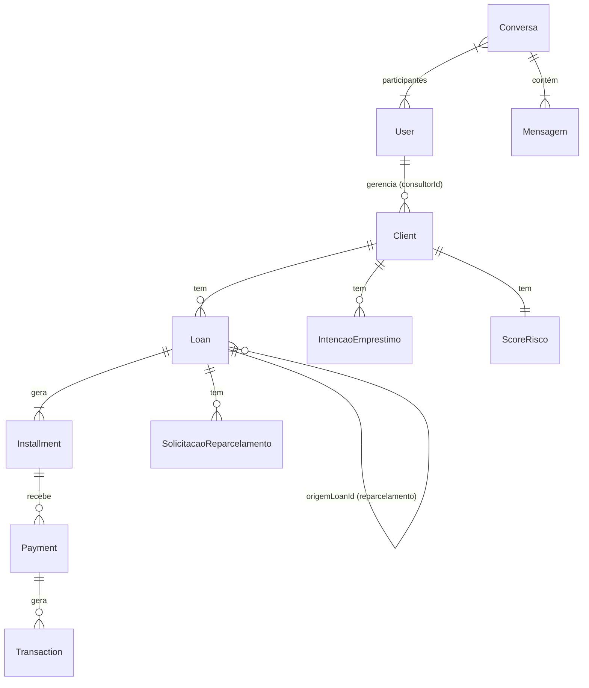

# SIAFI 2.0 — Database (Prisma + PostgreSQL / Supabase)
> Última atualização: 2026-05-23
> **Banco:** PostgreSQL via Supabase Cloud (região sa-east-1 — São Paulo)
> **Projeto:** `lvpseuaybpnmrneuyndi` · `https://lvpseuaybpnmrneuyndi.supabase.co`

---

## 1. Visão Geral

| Item | Valor |
|------|-------|
| ORM | Prisma 5 |
| Schema | `siafi_v2` |
| Pooler (API) | `aws-0-sa-east-1.pooler.supabase.com:6543` (Transaction mode) |
| Direct (Migrations) | `db.lvpseuaybpnmrneuyndi.supabase.co:5432` |

```prisma
datasource db {
  provider  = "postgresql"
  url       = env("DATABASE_URL")        // pooler — usar na API
  directUrl = env("DIRECT_DATABASE_URL") // direct — usar em migrations
}
```

---

## 2. Enums

### UserRole
```prisma
enum UserRole {
  admin
  financeiro
  consultor   // adicionado na v2.0
  caixa
  cliente
}
```
> `usuario` removido na v2.0. Use `caixa` para operadores de caixa.

### LoanStatus
```prisma
enum LoanStatus {
  aguardando_aceite    // contrato gerado, aguardando assinatura digital
  aguardando_liberacao // assinado, aguardando entrega do capital pelo caixa
  ativo                // capital entregue, parcelas em andamento
  quitado              // todas as parcelas pagas
  cancelado            // cancelado manualmente ou por SLA expirado
  renegociado          // substituído por novo loan via reparcelamento
}
```

### InstallmentStatus
```prisma
enum InstallmentStatus {
  pendente
  parcialmente_pago  // adicionado na v2.0 — saldoDevedor em aberto
  pago
  atrasado
  cancelado
}
```

### Outros Enums

| Enum | Valores |
|------|---------|
| `PaymentMethod` | `dinheiro`, `pix`, `ted`, `boleto`, `outros` |
| `TransactionType` | `entrada`, `saida` |
| `IntencaoStatus` | `rascunho`, `pendente`, `em_analise`, `aprovada`, `rejeitada`, `expirada` |
| `ReparcelamentoStatus` | `solicitado`, `proposta_enviada`, `aguardando_aprovacao`, `aprovado`, `rejeitado`, `executado` |
| `CobrancaCanal` | `whatsapp`, `email`, `portal`, `presencial`, `telefone` |
| `CobrancaResultado` | `contactado_pagamento_prometido`, `sem_contato`, `solicitou_reparcelamento`, `outros` |

---

## 3. Models Core

### User
Campos principais: `id`, `name`, `email`, `role (UserRole)`, `supabaseId`, `active`, `mfaEnabled`, `loginCount`, `consultorId?`, `createdAt`, `updatedAt`

> `loginCount` controla o prazo de 5 logins para MFA de `caixa` e `cliente`. `consultorId` vincula o operador à sua carteira.

### Client
Campos principais: `id`, `name`, `cpf`, `phone`, `email`, `address (Json)`, `fotoUrl?`, `rgUrl?`, `comprovanteUrl?`, `supabaseId?`, `portalAtivo`, `consultorId?`, `active`, `createdAt`

> `supabaseId` é preenchido quando o portal é ativado. `portalAtivo` controla o acesso ao portal do cliente.

### Loan
Campos principais: `id`, `clientId`, `consultorId?`, `status (LoanStatus)`, `principal_amount (Decimal)`, `target_profit (Decimal)`, `total_receivable (Decimal)`, `installment_amount (Decimal)`, `numeroParcelas`, `dataInicio`, `diaVencimento`, `multa (Decimal)`, `mora (Decimal)`, `diasAntecedencia`, `origemLoanId?`, `reparcelamentoCount`, `aceiteClienteHash?`, `aceiteClienteAt?`, `liberadoAt?`, `createdAt`

> `origemLoanId` referencia o loan original em reparcelamentos. `aceiteClienteHash` é o SHA-256 do aceite digital. `liberadoAt` é preenchido pelo caixa ao confirmar a entrega.

### Installment
Campos principais: `id`, `loanId`, `numero`, `dueDate`, `amount (Decimal)`, `principal_payback (Decimal)`, `net_gain (Decimal)`, `status (InstallmentStatus)`, `saldoDevedor (Decimal)`, `moraAcumulada (Decimal)`, `paidAt?`

> `principal_payback` e `net_gain` **nunca** são serializados para `caixa` ou `cliente`. `saldoDevedor` acumula em pagamentos parciais. `moraAcumulada` é atualizada pelo cron diário.

### Payment
Campos principais: `id`, `installmentId`, `loanId`, `clientId`, `amount (Decimal)`, `method (PaymentMethod)`, `mercadoPagoId?`, `estornado`, `createdBy`, `createdAt`

> `mercadoPagoId` é preenchido pelo webhook. `estornado` bloqueia novo estorno do mesmo pagamento.

### Transaction
Campos principais: `id`, `type (TransactionType)`, `amount (Decimal)`, `description`, `loanId?`, `paymentId?`, `createdBy`, `createdAt`

> Gerada automaticamente em liberações de capital (saída) e pagamentos (entrada). Também criada em lançamentos manuais.

---

## 4. Models de Fluxo

### IntencaoEmprestimo
Campos principais: `id`, `clientId`, `consultorId`, `status (IntencaoStatus)`, `valorSolicitado (Decimal)`, `numeroParcelas`, `diaVencimento`, `finalidade`, `observacoes`, `motivoRejeicao?`, `prazoAnalise`, `loanId?`, `createdAt`

> `loanId` é preenchido ao aprovar — liga a intenção ao contrato gerado. `prazoAnalise` é o timestamp de expiração do SLA.

### SolicitacaoReparcelamento
Campos principais: `id`, `loanId`, `clientId`, `consultorId?`, `status (ReparcelamentoStatus)`, `motivoSolicitacao`, `novoValorPrincipal?`, `novoNumeroParcelas?`, `novoValorParcela?`, `aceiteClienteHash?`, `aceiteClienteAt?`, `createdAt`

### Renegociacao
Campos principais: `id`, `loanId`, `valorOriginal (Decimal)`, `valorNovo (Decimal)`, `observacoes`, `createdBy`, `createdAt`

---

## 5. Models de Comunicação

### Conversa
Campos: `id`, `createdAt`
Relacionamentos: `participantes (ConversaParticipante[])`, `mensagens (Mensagem[])`

Criação idempotente: se já existe conversa entre os dois usuários, retorna a existente.

### ConversaParticipante
Campos: `id`, `conversaId`, `userId`, `ultimaLeitura?`

> `ultimaLeitura` é atualizado ao acessar `GET /mensagens/conversas/:id` — base para o cálculo de não-lidas.

### Mensagem
Campos: `id`, `conversaId`, `autorId`, `conteudo`, `anexoUrl?`, `createdAt`

---

## 6. Models de Operações

### EmailTemplate
Campos principais: `id`, `type (String)`, `assunto`, `corpo`, `variaveis (Json)`, `updatedAt`

> 13 tipos predefinidos. Editável pelo admin via painel. `variaveis` armazena a lista de variáveis disponíveis para o template.

### CobrancaContato
Campos principais: `id`, `installmentId`, `clientId`, `consultorId`, `canal (CobrancaCanal)`, `resultado (CobrancaResultado)`, `observacoes?`, `createdAt`

> Registrado pelo consultor ao realizar tentativa de cobrança.

### ScoreRisco
Campos principais: `id`, `clientId`, `score (Int)`, `pontualidade (Decimal)`, `reparcelamentos (Decimal)`, `quitacoes (Decimal)`, `updatedAt`

> Um registro por cliente. Recalculado via `void scoreRisco.recalcularScore(clientId)` sempre de forma fire-and-forget.

### ConsultorSolicitacao
Campos principais: `id`, `consultorId`, `tipo`, `urgencia`, `descricao`, `resposta?`, `status`, `createdAt`

---

## 7. Models de Sistema

### Notification
Campos: `id`, `userId?`, `clientId?`, `type`, `channel`, `status`, `payload (Json)`, `createdAt`

### AuditLog
Campos: `id`, `userId`, `action`, `entity`, `entityId?`, `before (Json?)`, `after (Json?)`, `ip?`, `createdAt`

> Sem endpoint de DELETE. Imutável por design — nenhuma migration deve adicionar cascade delete.

### SiteSetting
Campos: `id`, `key (String @unique)`, `value`, `updatedAt`

> Chaves relevantes: `financeiro.sla_aceite_dias`, `financeiro.sla_intencao_horas`, `financeiro.multa_padrao`, `financeiro.mora_diaria_padrao`, `financeiro.dias_antecedencia_cobranca`, `financeiro.max_reparcelamentos`, `empresa.contato_suporte`, `empresa.logoUrl`.

### SupportTicket
Campos: `id`, `clientId?`, `userId?`, `tipo`, `descricao`, `status`, `resposta?`, `createdAt`

---

## 8. Relacionamentos Críticos (ERD)



---

## 9. Convenções do Schema

| Convenção | Regra |
|-----------|-------|
| Nomenclatura de campos | snake_case no banco · camelCase nos models Prisma |
| Soft-delete | `active Boolean @default(true)` em `User` e `Client` |
| Timestamps padrão | `createdAt DateTime @default(now())` + `updatedAt DateTime @updatedAt` |
| Valores monetários | `Decimal` — nunca `Float` |
| IDs | `String @id @default(cuid())` |
| Non-null assertions | Usar `!` apenas após validação prévia confirmada |
| AuditLog | Sem cascade delete — nunca perder registros de auditoria |

---

## 10. Supabase Storage

| Bucket | Visibilidade | Política de acesso |
|--------|-------------|-------------------|
| `client-documents` | Privado | Operadores autenticados via JWT; cliente não acessa diretamente |
| `boletos-cobranca` | Privado | URL assinada gerada pelo backend com validade limitada |
| `mensagens-docs` | Privado | Participantes da conversa via JWT |

---

## 11. Supabase Realtime

Habilitar a publication para as tabelas ativas:

```sql
-- Executar no SQL Editor do Supabase
ALTER PUBLICATION supabase_realtime ADD TABLE mensagens;
ALTER PUBLICATION supabase_realtime ADD TABLE solicitacoes_reparcelamento;
ALTER PUBLICATION supabase_realtime ADD TABLE installments;
ALTER PUBLICATION supabase_realtime ADD TABLE payments;
ALTER PUBLICATION supabase_realtime ADD TABLE transactions;
```

---

## 12. RLS Pendente — Aplicar em Produção

```sql
-- Executar no SQL Editor do Supabase (projeto lvpseuaybpnmrneuyndi)
ALTER TABLE loans        ENABLE ROW LEVEL SECURITY;
ALTER TABLE installments ENABLE ROW LEVEL SECURITY;

CREATE POLICY "cliente_ver_proprios_loans" ON loans
  FOR SELECT TO authenticated
  USING (client_id = (
    SELECT id FROM clients WHERE supabase_id = auth.uid() LIMIT 1
  ));

CREATE POLICY "cliente_ver_proprias_installments" ON installments
  FOR SELECT TO authenticated
  USING (loan_id IN (
    SELECT id FROM loans
    WHERE client_id = (
      SELECT id FROM clients WHERE supabase_id = auth.uid() LIMIT 1
    )
  ));
```

---

## 13. Migrations

```bash
# Desenvolvimento — gera migration a partir de mudanças no schema.prisma
npx prisma migrate dev --name descricao_da_mudanca

# Verificar estado das migrations pendentes
npx prisma migrate status

# Produção — aplica migrations pendentes sem recriar o banco
npx prisma migrate deploy

# Reset completo (APENAS desenvolvimento local)
npx prisma migrate reset
```

**Convenção de nomes:** `YYYYMMDD_descricao_curta`
Ex: `20260521_add_reparcelamento_count`, `20260523_add_mora_acumulada`

⚠️ Em produção usar sempre `migrate deploy`. Verificar `migrate status` antes de aplicar. Nunca usar `migrate reset` em produção.

---

*Última atualização: 2026-05-23 | Mantido por: equipe SIAFI*
