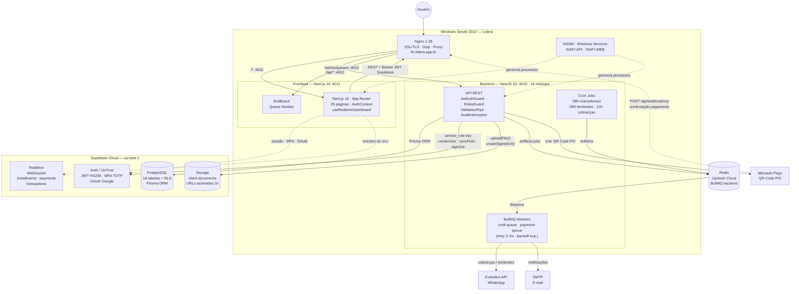

# SIAFI 2.0
## Sistema Integrado de Apoio Financeiro

> **Lidera** · Gestão de Crédito e Empréstimos · 2026

---

&nbsp;

# Uma Plataforma. Toda a Operação.

O **SIAFI** centraliza o controle completo da carteira de crédito da Lidera — do cadastro do cliente ao recebimento final — em uma interface moderna, rápida e segura.

&nbsp;

---

&nbsp;

## O Problema que Resolvemos

Antes do SIAFI, a operação dependia de:

```
❌  Planilhas manuais sujeitas a erros
❌  Sem visibilidade em tempo real da carteira
❌  Controle de inadimplência reativo (não proativo)
❌  Sem rastreamento de quem fez o quê
❌  Pagamentos registrados manualmente sem validação
❌  Dificuldade em gerar relatórios gerenciais
```

---

## A Solução

```
✅  Dashboard com visão em tempo real da carteira (atualização automática)
✅  Cadastro completo de clientes com documentos na nuvem
✅  Empréstimos com geração automática de parcelas
✅  Controle de inadimplência com lista de clientes em atraso
✅  Registro de pagamentos com auditoria completa
✅  Relatórios gerenciais com indicadores estratégicos
✅  Integração PIX (QR Code via Mercado Pago)
✅  Autenticação segura com MFA (dois fatores)
✅  Segurança com perfis de acesso por função
```

---

&nbsp;

# Números do Sistema

&nbsp;

| Indicador | Valor |
|-----------|-------|
| Telas operacionais | **25 páginas** |
| Módulos de back-end | **16 módulos** |
| Perfis de acesso | **5 roles** |
| Operações automatizadas | **3 cron jobs diários** |
| Filas de processamento | **2 queues BullMQ** |
| Tecnologias de integração | **PIX · WhatsApp · E-mail · Supabase** |

&nbsp;

---

&nbsp;

# Telas do Sistema

&nbsp;

## Dashboard — Visão em Tempo Real

```
┌─────────────────┬─────────────────┬─────────────────┬─────────────────┐
│  Clientes       │  Empréstimos    │  Clientes       │  Clientes       │
│    Ativos       │    Ativos       │   Atrasados     │   Quitados      │
│                 │                 │                 │                 │
│     [48] ──────►│    [32] ──────► │    [7] ──────►  │     [15]        │
│   /clientes     │  /emprestimos   │  /inadimplentes │                 │
└─────────────────┴─────────────────┴─────────────────┴─────────────────┘

┌────────────────────────────┐  ┌────────────────────────────┐
│  ⚠ Clientes Atrasados   🟢 │  │  ✓ Clientes Quitados       │
│                            │  │                            │
│  João Silva    [3 parcelas]│  │  Maria Souza    [Quitado]  │
│  Ana Costa     [1 parcela] │  │  Pedro Lima     [Quitado]  │
│  Carlos Pires  [2 parcelas]│  │  Lucia Ferreira [Quitado]  │
│                            │  │                            │
│  [Ver todos →]             │  │                            │
└────────────────────────────┘  └────────────────────────────┘
                  🟢 = Realtime ativo
```

---

## Gestão de Clientes

```
┌─────────────────────────────────────────────────────────────┐
│  Clientes                                  [+ Novo Cliente] │
├─────────────────────────────────────────────────────────────┤
│  🔍 Buscar por nome, CPF/CNPJ ou WhatsApp... [Status ▾]     │
├──────────────────┬──────────┬──────────┬────────┬───────────┤
│  Nome            │  CPF/CNPJ│ WhatsApp │ Status │   Ações   │
├──────────────────┼──────────┼──────────┼────────┼───────────┤
│  João da Silva   │ 123...   │ 61 9...  │ Ativo  │  👁  ✏    │
│  Maria Souza     │ 456...   │ 61 8...  │ Ativo  │  👁  ✏    │
│  Carlos Pires    │ 789...   │ 61 7...  │ Inativo│  👁  ✏    │
└──────────────────┴──────────┴──────────┴────────┴───────────┘
```

**Perfil do Cliente inclui:**
- Dados pessoais · Contato · Endereço
- Documentos (Foto · RG · Comprovante — armazenados na nuvem)
- Histórico de **todos os contratos** numerados sequencialmente
- Acesso direto para novo empréstimo

---

## Criação de Empréstimo — Simples e Direto

```
┌─────────────────────────────────────────────────────────┐
│  Novo Empréstimo                                        │
├─────────────────────────────────────────────────────────┤
│  Cliente          [João da Silva                    ▾]  │
│  Valor             R$ [    800,00]                       │
│  Número de parcelas    [  5      ]                       │
│  Valor da parcela  R$ [    280,00]  ← ENTRADA DIRETA    │
│  Forma de pagamento  [Débito Cartão                 ▾]   │
│  Data de início    [  19/05/2026 ]                       │
├─────────────────────────────────────────────────────────┤
│  🧮 Simulação                                           │
│  Capital: R$ 800,00  │  5x de R$ 280,00                │
│  Total a Pagar: R$ 1.400,00  │  Acréscimo: R$ 600,00   │
├─────────────────────────────────────────────────────────┤
│                              [Cancelar] [Criar Empréstimo]│
└─────────────────────────────────────────────────────────┘
```

> Parcelas geradas **automaticamente**. Sem cálculos manuais.

---

## Controle de Inadimplência

```
┌─────────────────────────────────────────────────────────────┐
│  Inadimplentes                                              │
├────────────────┬──────────────┬────────────┬────────────────┤
│  Cliente       │  Empréstimo  │  Saldo Dev.│  Ações         │
├────────────────┼──────────────┼────────────┼────────────────┤
│  João Silva    │  Empréstimo  │ R$ 560,00  │ [Renegociar]   │
│                │  #12         │            │ [Ver]          │
├────────────────┼──────────────┼────────────┼────────────────┤
│  Ana Costa     │  Empréstimo  │ R$ 280,00  │ [Renegociar]   │
│                │  #18         │            │ [Ver]          │
└────────────────┴──────────────┴────────────┴────────────────┘
```

---

## Relatórios Gerenciais — Carteira

```
┌──────────────────┬──────────────────┬──────────────────┬──────────────────┐
│  Valor           │  Valor Total     │  Valor           │  A Receber       │
│  Investido       │  Parcelado       │  Recebido        │                  │
│                  │                  │                  │                  │
│  R$ 28.500,00   │  R$ 41.200,00   │  R$ 18.700,00   │  R$ 22.500,00   │
└──────────────────┴──────────────────┴──────────────────┴──────────────────┘
       ↑                  ↑                  ↑                  ↑
  Capital total      Total bruto        Já recebido       Ainda a receber

┌─────────────────────────────┐  ┌─────────────────────────────┐
│  Empréstimos Ativos         │  │  Empréstimos em Atraso       │
│              32             │  │               7              │
└─────────────────────────────┘  └─────────────────────────────┘
```

---

&nbsp;

# Arquitetura Técnica

&nbsp;



### Stack Tecnológico

| Camada | Tecnologia | Por quê |
|--------|-----------|---------|
| **Backend** | NestJS 10 + TypeScript | Estrutura modular, tipagem forte, testável |
| **Frontend** | Next.js 16 + App Router | Performance, rotas protegidas, SSR |
| **Banco** | PostgreSQL + Prisma 5 | Confiabilidade + migrations versionadas |
| **Auth** | Supabase GoTrue (JWT HS256) | MFA TOTP, OAuth Google, sessões gerenciadas |
| **Storage** | Supabase Storage | Documentos privados na nuvem, URLs assinadas |
| **Realtime** | Supabase Realtime | Dashboard atualizado automaticamente via WebSocket |
| **Filas** | BullMQ + Redis (Upstash) | Notificações e pagamentos assíncronos com retry |
| **Deploy** | NSSM + Windows Server | Ambiente de produção estável |
| **UI** | Tailwind CSS 4 + shadcn/ui | Interface moderna e responsiva |

---

&nbsp;

# Segurança

&nbsp;

```
🔐  Autenticação via Supabase GoTrue JWT (15 minutos de expiração)
🔑  MFA TOTP obrigatório para perfis Administrador e Financeiro
🔄  Refresh Token automático e silencioso (7 dias, httpOnly cookie)
👤  5 perfis de acesso com permissões granulares
🛡️  Row Level Security (RLS) em todas as 16 tabelas do banco
📋  Auditoria completa de todas as ações do sistema
🔒  HTTPS com SSL Let's Encrypt em produção
🗄️  Documentos armazenados em bucket privado (Supabase Storage)
🔗  URLs de documentos assinadas (expiram em 1 hora)
```

---

&nbsp;

# Integrações

&nbsp;

| Integração | Finalidade | Status |
|-----------|-----------|--------|
| **Supabase** | PostgreSQL · Auth (MFA/OAuth) · Storage · Realtime | ✅ Ativo |
| **Redis (Upstash)** | Backend das filas BullMQ · processamento assíncrono | ✅ Ativo |
| **Mercado Pago** | Geração de QR Code PIX · Webhook de pagamento | Configurável |
| **Evolution API** | Envio de cobranças e lembretes via WhatsApp | Configurável |
| **SMTP** | Notificações por e-mail | Configurável |

---

&nbsp;

# Automações (Cron Jobs Diários)

&nbsp;

```
08:00  ─────►  Marca parcelas vencidas como "Em Atraso"
                ↓
09:00  ─────►  Envia lembretes de parcelas próximas do vencimento
                ↓ (via WhatsApp / E-mail)
10:00  ─────►  Envia cobranças para parcelas em atraso
```

> Toda a cobrança acontece **automaticamente**, sem intervenção manual.

---

&nbsp;

# Perfis de Acesso

&nbsp;

```
┌─────────────────────────────────────────────────────────────────┐
│                    PERFIS DE ACESSO                            │
├──────────────┬──────────┬───────────┬──────────┬───────────────┤
│    Recurso   │  Admin   │ Financeiro│  Caixa   │   Usuário     │
├──────────────┼──────────┼───────────┼──────────┼───────────────┤
│  Dashboard   │    ✅    │    ✅     │    ✅    │      ✅       │
│  Clientes    │    ✅    │    ✅     │  👁 ler  │      ❌       │
│  Empréstimos │    ✅    │    ✅     │    ❌    │      ❌       │
│  Pagamentos  │    ✅    │    ✅     │    ✅    │      ❌       │
│  Caixa       │    ✅    │    ✅     │    ✅    │      ❌       │
│  Relatórios  │    ✅    │    ✅     │    ❌    │      ❌       │
│  Usuários    │    ✅    │    ❌     │    ❌    │      ❌       │
│  Config.     │    ✅    │    ❌     │    ❌    │      ❌       │
│  Auditoria   │    ✅    │    ❌     │    ❌    │      ❌       │
└──────────────┴──────────┴───────────┴──────────┴───────────────┘
```

---

&nbsp;

# Roadmap — Próximas Entregas

&nbsp;

| Prioridade | Funcionalidade | Descrição |
|-----------|---------------|-----------|
| 🔴 Alta | **Multa e Mora por Atraso** | Calcular e exibir valor reajustado para parcelas vencidas |
| 🟡 Média | **Portal do Cliente** | App web para clientes consultarem contratos e parcelas |
| 🟡 Média | **Contratos em PDF** | Geração automática de contrato de empréstimo formatado |
| 🟡 Média | **Gráficos no Dashboard** | Evolução de carteira, inadimplência e recebimentos |
| 🟢 Baixa | **Exportação Excel/PDF** | Exportar relatórios e listas para planilha ou PDF |
| 🟢 Baixa | **Templates de E-mail** | Personalizar mensagens de cobrança e lembrete |

---

&nbsp;

# Por Que o SIAFI

&nbsp;

```
Antes                          Depois (SIAFI 2.0)
──────────────────────────     ──────────────────────────────────
Planilhas → Erro humano        Registro digital → Zero duplicatas
Sem histórico de ações         Auditoria completa de cada ação
Inadimplência descoberta tarde Lista de atrasados em tempo real
Sem integração PIX             QR Code gerado em 1 clique
Relatórios manuais             Relatórios automáticos em segundos
Senha compartilhada            MFA + perfis individuais com rastreio
Documentos em papel/local      Documentos na nuvem com acesso seguro
```

---

&nbsp;

```
━━━━━━━━━━━━━━━━━━━━━━━━━━━━━━━━━━━━━━━━━━━━━━━━━━━━━━━━━━━━━━━

  SIAFI 2.0 — Sistema Integrado de Apoio Financeiro
  Lidera · lideraabrange@gmail.com
  https://financeiro.lidera.app.br

  Desenvolvido com  NestJS · Next.js · Prisma · Supabase · Tailwind

━━━━━━━━━━━━━━━━━━━━━━━━━━━━━━━━━━━━━━━━━━━━━━━━━━━━━━━━━━━━━━━
```

*Versão 2.0 · Maio 2026*
