# SIAFI 2.0 — Fluxograma de Empréstimos

> Última atualização: 2026-05-22

Este documento descreve o ciclo de vida completo de um contrato de empréstimo no SIAFI, da intenção inicial até a quitação ou cancelamento.

---

## Fluxo Completo (Mermaid)

```mermaid
flowchart TD
    START([Início]) --> A

    %% ─── INTENÇÃO ───────────────────────────────────────────────
    A[Consultor cria\nIntenção de Empréstimo] --> B{Financeiro analisa\ndentro do SLA\n48h?}
    B -- Não / Expira --> EXPIRA([Intenção expirada\nConsultor notificado])
    B -- Rejeita --> REJEIT([Intenção rejeitada\ncom feedback])
    B -- Aprova --> C

    %% ─── CRIAÇÃO DO CONTRATO ─────────────────────────────────────
    C[Contrato criado automaticamente\nstatus: aguardando_aceite\nParcelas pré-geradas\nPortal do cliente ativado\nse ainda não estava] --> D

    %% ─── SLA DE ACEITE ───────────────────────────────────────────
    D{Cliente assina\nno portal dentro\ndo prazo N dias?}
    D -- D-2: alerta ao cliente\nD-1: alerta ao consultor --> D
    D -- Não assina / Expira --> CANCEL1([Contrato cancelado\nParcelas canceladas\nIntenção volta a 'aprovado'])
    D -- Assina\naceite digital SHA-256 --> E

    %% ─── LIBERAÇÃO DE CAPITAL ────────────────────────────────────
    E[status: aguardando_liberacao\nFinanceiro/Caixa confirma\nentrega física do capital] --> F
    F[Status: ATIVO\nDatas das parcelas recalculadas\nSaída registrada no caixa\nCliente notificado] --> G

    %% ─── CICLO DE PARCELAS ───────────────────────────────────────
    G[[Parcelas pendentes\ngeradas com dia fixo\nde vencimento]] --> H

    %% ─── COBRANÇA ANTECIPADA ─────────────────────────────────────
    H{N dias antes\ndo vencimento?}
    H -- Sim --> H1[Cron 09h30\nGera PDF boleto\nEnvia WhatsApp + Email + Portal]
    H1 --> I
    H -- Não --> I

    %% ─── VENCIMENTO ──────────────────────────────────────────────
    I{Parcela paga\nno vencimento?}
    I -- Pago integralmente --> PAGO[Status: PAGO\nRegistra pagamento\nScore recalculado]
    I -- Pago parcialmente --> PARC[Status: PARCIALMENTE_PAGO\nSaldo devedor registrado\nMora acumulada diariamente]
    I -- Não pago --> ATRASO

    %% ─── ATRASO ──────────────────────────────────────────────────
    ATRASO[Cron 08h00\nStatus: ATRASADO\nNotificação enviada\nCron 10h00]
    ATRASO --> ENCARGOS[Cron 08h05\nMulta aplicada 1x\nMora diária sobre\nsaldo devedor]
    ENCARGOS --> PAGA_AT{Cliente paga\no saldo devedor?}
    PAGA_AT -- Sim --> PAGO
    PAGA_AT -- Não --> RENEGOC

    %% ─── PAGAMENTO PARCIAL ───────────────────────────────────────
    PARC --> PAGA_PARC{Próximo pagamento\nquita o saldo?}
    PAGA_PARC -- Sim --> PAGO
    PAGA_PARC -- Não --> PARC

    %% ─── VERIFICAÇÃO DE QUITAÇÃO ─────────────────────────────────
    PAGO --> ULTIMA{É a última\nparcela?}
    ULTIMA -- Não --> G
    ULTIMA -- Sim --> QUITADO

    %% ─── QUITAÇÃO ────────────────────────────────────────────────
    QUITADO([Loan status: QUITADO\nScore recalculado\nCliente notificado])

    %% ─── RENEGOCIAÇÃO / REPARCELAMENTO ───────────────────────────
    RENEGOC{Ação de\nrecuperação}
    RENEGOC -- Renegociação simples --> RENEG_OK[Acordo registrado\nNovos prazos definidos]
    RENEG_OK --> I
    RENEGOC -- Reparcelamento --> REPAR

    %% ─── FLUXO DE REPARCELAMENTO ─────────────────────────────────
    REPAR[Consultor/Cliente\nsolicita reparcelamento] --> PROP[Financeiro envia\nproposta com simulação]
    PROP --> APROV{Admin aprova\n2ª instância?}
    APROV -- Não --> REJEIT2([Reparcelamento\nrejeitado])
    APROV -- Sim --> EXEC

    EXEC[Execução atômica\n① Loan original cancelado\n② Parcelas não pagas canceladas\n③ Novo loan criado\n④ Score recalculado]
    EXEC --> F

    %% ─── CANCELAMENTO MANUAL ─────────────────────────────────────
    G -. Cancelamento\nmanual .-> CANCEL2([Loan cancelado\nParcelas pendentes\ncanceladas])

    %% ─── ESTILOS ─────────────────────────────────────────────────
    classDef start fill:#6366f1,color:#fff,stroke:none
    classDef end_ok fill:#16a34a,color:#fff,stroke:none
    classDef end_nok fill:#dc2626,color:#fff,stroke:none
    classDef decision fill:#f59e0b,color:#1f2937,stroke:#d97706
    classDef process fill:#2563eb,color:#fff,stroke:none
    classDef auto fill:#0891b2,color:#fff,stroke:none
    classDef warn fill:#ea580c,color:#fff,stroke:none

    class START start
    class QUITADO end_ok
    class EXPIRA,REJEIT,CANCEL1,CANCEL2,REJEIT2 end_nok
    class B,D,I,ULTIMA,PAGA_AT,PAGA_PARC,RENEGOC,APROV,H decision
    class A,C,E,F,REPAR,PROP,EXEC process
    class H1,ATRASO,ENCARGOS auto
    class PARC,G warn
```



---

## Legenda de Status

| Status do Loan | Cor | Descrição |
|----------------|-----|-----------|
| `aguardando_aceite` | 🟡 Amarelo | Criado, aguardando assinatura do cliente |
| `aguardando_liberacao` | 🔵 Azul | Aceito, aguardando entrega do capital |
| `ativo` | 🟢 Verde | Em andamento |
| `quitado` | 🟩 Verde escuro | Todas as parcelas pagas |
| `cancelado` | 🔴 Vermelho | SLA vencido ou cancelamento manual |

| Status da Parcela | Descrição |
|-------------------|-----------|
| `pendente` | Ainda não venceu |
| `atrasado` | Vencida sem pagamento |
| `parcialmente_pago` | Parte do valor foi pago |
| `pago` | Quitada integralmente |
| `cancelado` | Loan cancelado antes do vencimento |

---

## Etapas Detalhadas

### 1. Intenção de Empréstimo
- **Quem:** Consultor (ou Admin/Financeiro diretamente)
- **SLA:** 48h para análise (configurável em Configurações)
- **Cron `sla-intencoes`:** verifica a cada 2h — alerta se próxima do vencimento
- **Aprovação:** cria contrato automaticamente + ativa portal do cliente (se configurado)
- **Rejeição:** fecha com motivo registrado
- **Expiração:** status vai para `expirado`, consultor notificado

### 2. SLA de Aceite
- **Prazo:** N dias (padrão: 5 dias, configurável)
- **Cron `sla-aceite`** (07h00):
  - D-2: envia alerta ao cliente por email + WhatsApp
  - D-1: envia alerta ao consultor
  - D+0: cancela loan + parcelas + reverte intenção para `aprovado`
- **Aceite digital:** cliente assina no portal → hash SHA-256 gravado no loan

### 3. Liberação de Capital
- **Quem:** Caixa, Financeiro ou Admin
- **Ação:** `PATCH /loans/:id/liberar-capital`
- **Efeitos automáticos:**
  - Status → `ativo`
  - Datas das parcelas recalculadas a partir da data de liberação
  - Transação de saída registrada no caixa
  - Cliente notificado

### 4. Cobrança Antecipada (Cron 09h30)
- **Critério:** parcela vencendo em N dias (padrão: 10 dias por contrato)
- **Execução:**
  1. `CobrancaService.processarCobrancasAntecipadas()`
  2. Gera PDF boleto via PDFKit → upload no Supabase Storage (`boletos-cobranca`)
  3. Enfileira jobs: `whatsapp.cobranca-antecipada` + `email.cobranca-antecipada` (PDF em anexo)
  4. Marca `cobrancaEnviadaEm` na parcela

### 5. Vencimento e Encargos
- **Cron `mark-overdue`** (08h00): parcelas vencidas → `atrasado`
- **Cron `atualizar-encargos`** (08h05):
  - Multa: aplicada **uma vez** quando a parcela entra em atraso (`multaAplicada`)
  - Mora: calculada **diariamente** sobre o `saldoDevedor` (`moraAcumulada += saldoDevedor × taxaMoraDiaria`)
- **Configuração:** por contrato (`multaPercentual`, `moraDiariaPercentual`) ou global (SiteSetting)

### 6. Pagamento
- **Integral:** parcela → `pago`; se última → loan → `quitado`
- **Parcial:** parcela → `parcialmente_pago`; `saldoDevedor` reduzido; mora continua
- **Score de risco:** recalculado automaticamente (fire-and-forget) após qualquer pagamento

### 7. Reparcelamento
- **Execução atômica** via `Prisma.$transaction`:
  1. Loan original → `cancelado`
  2. Parcelas pendentes → `cancelado`
  3. Novo loan criado com `origemLoanId` e `reparcelamentoCount + 1`
  4. `aceiteClienteHash` registrado
  5. `SolicitacaoReparcelamento` → `executado`
  6. Score recalculado (penaliza)

---

## Crons Relacionados ao Ciclo

```
02h00  conciliacao-pix          → Verifica PIX pendentes no Mercado Pago
07h00  sla-aceite               → Alertas D-2/D-1; cancela vencidos
08h00  mark-overdue             → Parcelas → atrasado
08h05  atualizar-encargos       → Multa (1x) + mora diária
09h00  send-reminders           → Lembretes de vencimento próximo
09h30  cobrancas-antecipadas    → PDF + WhatsApp + Email
10h00  send-overdue             → Notifica inadimplentes
11h00  lembrete-reparcelamentos → Cobranças pendentes de reparcelamento
14h00  reenviar-cobrancas       → Reenvio não-lidas no portal
*/2h   sla-intencoes            → Monitora SLA de intenções
```

---

## Regras de Negócio Importantes

1. **Decimal.js obrigatório** em todos os cálculos financeiros — precisão 20, ROUND_HALF_UP
2. **Campos internos nunca expostos ao portal:** `principalPayback`, `netGain`, `valorInvestido`
3. **Score de risco sempre fire-and-forget** — nunca propaga erro para o fluxo principal
4. **Reparcelamento é atômico** — se qualquer etapa falhar, nada é confirmado
5. **Aceite digital é imutável** — o hash SHA-256 é gerado na assinatura e nunca alterado
6. **Liberação de capital recalcula datas** — as parcelas usam a data real de entrega do capital
7. **Multa aplicada apenas uma vez** — mora continua acumulando diariamente até quitação
8. **Soft-delete em tudo** — clientes e usuários nunca são excluídos fisicamente
